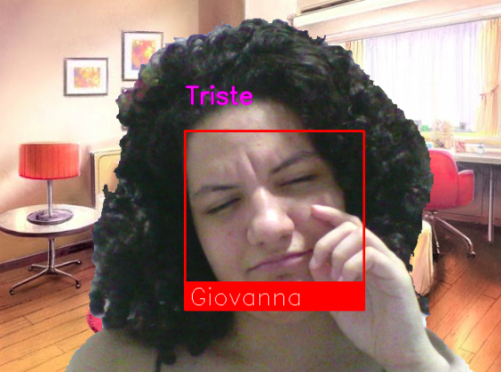
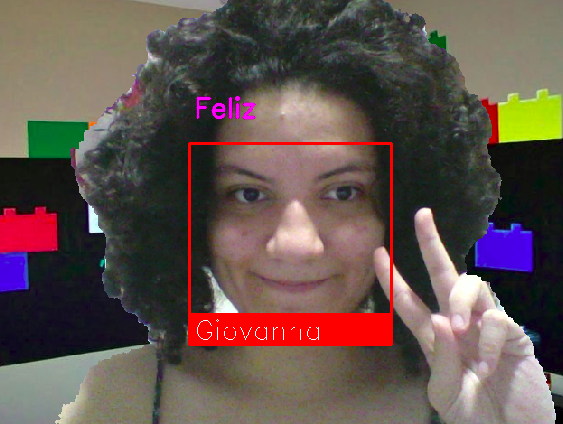

# Visao Computacional 

## Proposta 
O algoritmo deve:
- Acessar a câmera ou arquivo de vídeo;
- Exibir o retângulo ao redor dos rostos;
- Mostrar o nome da pessoa ou o termo: DESCONHECIDO quando não estiver registrado na rede neural;
- Descrever a expressão facial junto com o nome da pessoa;
- Ocultar as pessoas (mostrar o plano de fundo normal) caso elas se escondam atras de algum objeto colorido (pode ser a ideia do cromakey).

## Execução
Para rodar o programa, crie uma venv com o comando:

ˋˋˋ
virtualenv venv
ˋˋˋ 

Para ativar a venv:

ˋˋˋ
source venv/bin/activate 
ˋˋˋ

Se der erro na execução, favor verificar se não falta fazer um:

ˋˋˋ
sudo apt-get install python-dev 
ˋˋˋ
ou 
ˋˋˋ
sudo apt-get install python3-dev
ˋˋˋ
Para navegar entre as imagens de background, pressione "a" ou "d".
Para parar o código, pressione "q".

## Downloads 
- https://github.com/onnx/models/blob/master/vision/body_analysis/emotion_ferplus/README.md

## Resultado

